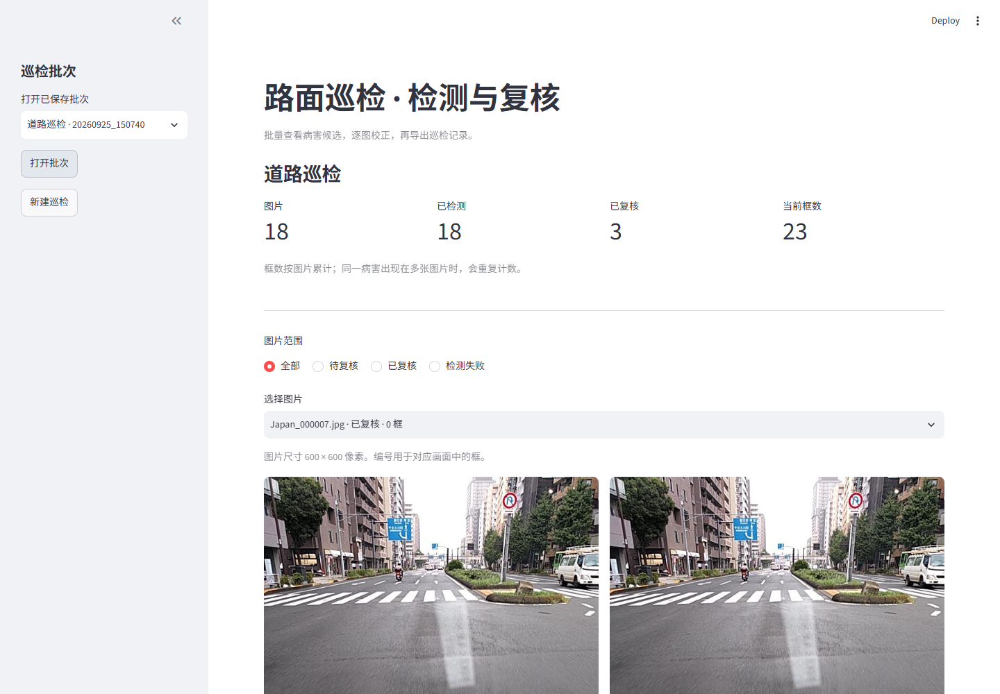
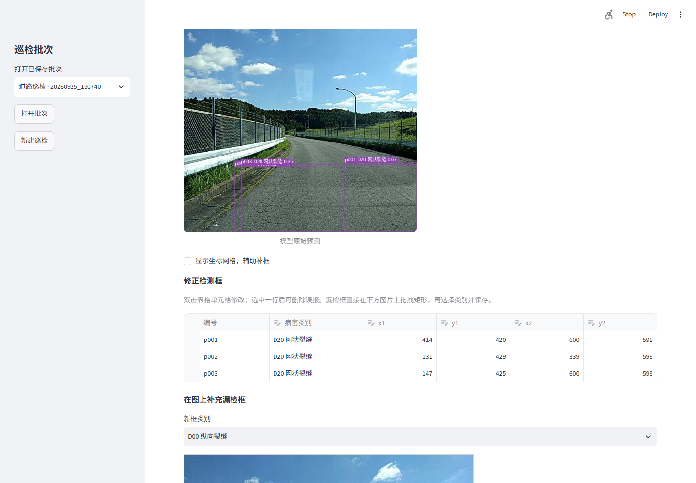
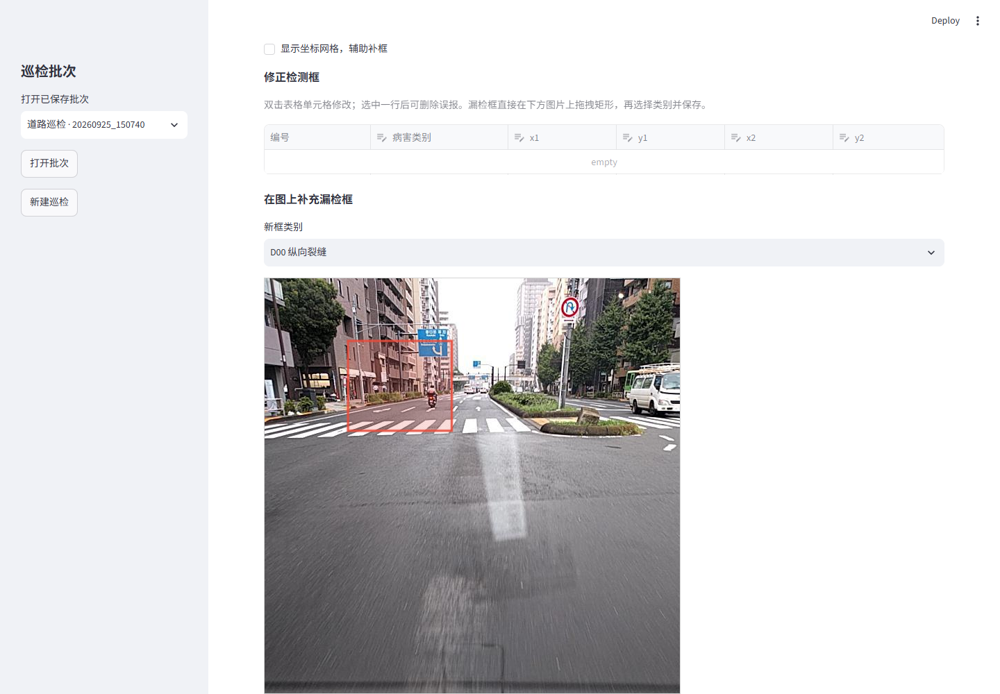
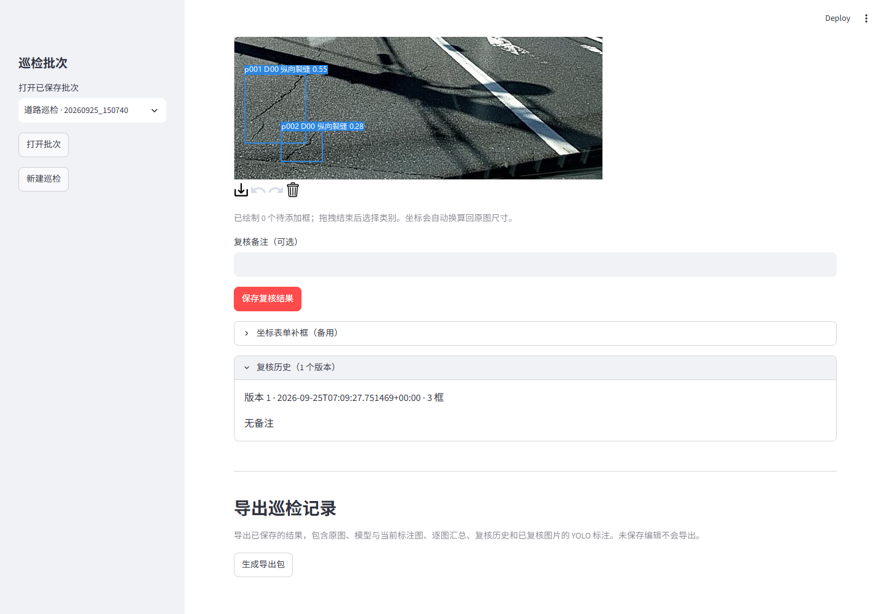

# Road Damage Detector

基于 YOLO11 的道路病害检测与人工复核项目，面向 RDD2022 的纵向裂缝、横向裂缝、网状裂缝和坑洞四类目标。

**当前状态（2026-09-25）：已完成 Japan/India 数据准备、三组训练对照、验证集错误分析、阈值分析、本地批量检测、人工复核、PT/ONNX 对照和 CPU 部署测速。已完成排除已知相似候选的留出测试；完整道路/序列独立测试仍待完成。**

| 实验 | 验证 mAP50 | 验证 mAP50–95 |
|---|---:|---:|
| YOLO11n，640（演示默认） | 44.206% | 19.611% |
| YOLO11n，960 | 42.026% | 18.024% |
| YOLO11n，640，D10 图片重复采样 | 44.818% | 19.677% |

各项取同一次训练的最佳 mAP50–95 轮。**现有划分存在跨集合近重复风险：自动筛出 47 对 train/val 相似候选，抽查发现高度相似道路画面。以上仅为当前图片划分下的验证结果，不能声称道路独立泛化成绩。** 详情见 [相似性审计](reports/split-similarity.md) 和 [实验对比](reports/n640-d10x2-results.md)。

## 快速体验

仓库不包含 RDD2022 原始数据、训练权重和 `runs/` 运行产物。准备好数据与 `runs/train/n640/weights/best.pt` 后，可以直接启动本地巡检页面：

```powershell
python -m pip install -e ".[dev,demo]"
python -m streamlit run app.py --server.address 127.0.0.1
```

打开 `http://127.0.0.1:8501`，选择「体验示例」或上传道路图片。页面支持批量检测、低置信度优先复核、图片拖框补标、表格修正、版本历史和 YOLO 标签导出。数据准备、训练、评测和 ONNX 部署流程见下文。

## 项目亮点

- 将 RDD2022 的 VOC XML 标注转换为 YOLO 格式，记录数据清单、哈希和异常样本。
- 用 YOLO11n 完成 640/960 输入和 D10 重采样对照，并对误检、漏检和置信度阈值进行分析。
- 增加跨集合近重复筛查和留出测试，明确报告图片级划分的泛化边界。
- 开发本地巡检工具：批量检测、图片拖框、删除误报、修改类别、复核历史和 YOLO 标签导出。
- 增加主动复核队列：按低置信度、候选框数量或空图抽查排序，把人工时间优先放在高风险样本上；排序只改变查看顺序，不修改模型结果。
- 导出 ONNX 并实现独立 ONNX Runtime CPU 推理；64 张验证图逐框一致，端到端中位数 39.71 ms/图。

## 项目结构

```text
road-damage-detector/
├── run.py                       统一命令行入口
├── app.py                       Streamlit 批量检测与人工复核
├── configs/
│   ├── base.yaml                公共训练配置
│   └── experiments.yaml         smoke / n640 / n960 / s640
├── src/road_damage/
│   ├── cli.py                   参数与命令分发
│   ├── common.py                路径、校验值和环境记录
│   ├── data.py                  XML 检查、YOLO 转换、分组划分、预览
│   ├── experiments.py           训练、评测、导出、推理
│   ├── duplicates.py            跨集合相似图筛查
│   └── inspection.py            批次持久化、复核历史、ZIP 导出
├── data/raw/                    解压后的原始数据（不提交）
├── data/processed/              生成的数据集（不提交）
├── runs/                        实验输出（不提交）
├── models/                      外部权重（不提交）
├── reports/                     可公开的报告
├── docs/                        数据来源、实验方案
└── tests/                       数据转换和实验入口的离线检查
```

## 1. 建立环境

以下命令在项目根目录的 PowerShell 中执行。可以复用已有兼容环境，也可以新建独立环境。

本机复用 `D:\CONDA\envs\pytorch314\python.exe`：PyTorch 2.11.0+cu128、Ultralytics 8.4.38、RTX 4060 Laptop GPU 已完成真实训练和网页推理；Streamlit 1.64.0 已安装。直接使用：

```powershell
& "D:\CONDA\envs\pytorch314\python.exe" run.py check
& "D:\CONDA\envs\pytorch314\python.exe" run.py train --preset smoke --dry-run
```

复用该环境时，本文后续的 `.\.venv\Scripts\python.exe` 均替换为 `& "D:\CONDA\envs\pytorch314\python.exe"`，无需新建环境。ONNX 1.23.0 和 ONNX Runtime 1.30.0 已在本机完成验证。

如果需要新建环境，再执行：

```powershell
python -m venv .venv
.\.venv\Scripts\python.exe -m pip install -e ".[dev]"
.\.venv\Scripts\python.exe run.py check
```

这一步仅安装数据处理和测试依赖。训练前按 [PyTorch 官方安装页](https://pytorch.org/get-started/locally/) 为本机安装支持 CUDA 的 PyTorch/torchvision，然后安装训练依赖：

```powershell
.\.venv\Scripts\python.exe -m pip install -e ".[train]"
.\.venv\Scripts\python.exe -c "import torch; print(torch.__version__, torch.cuda.is_available())"
.\.venv\Scripts\python.exe run.py check
```

期望 CUDA 检查为 True。`pyproject.toml` 给出依赖版本范围，不是锁定环境；复现时同时保留每次运行的环境信息，也可保存实际版本：

```powershell
.\.venv\Scripts\python.exe -m pip freeze > environment.freeze.txt
```

Ultralytics、模型和数据各自遵循其发布许可。首次训练可能下载预训练权重，需要网络。

## 2. 准备数据

按 [数据来源说明](docs/data-sources.md) 下载并解压 Japan、India 子集。程序扫描 `*/train/annotations/xmls/*.xml`，图片位于同一个 train 目录下的 images 中。

先确认 XML 的坐标约定。标准 1 起点、含端点 VOC 标注使用 `voc1`；若原数据已是 0 起点 xyxy，使用 `zero`。必须检查转换后的图片预览，不能仅按文件扩展名推断。

```powershell
.\.venv\Scripts\python.exe run.py prepare --raw data/raw/RDD2022 --out data/processed/rdd_v1 --coordinate-origin voc1
```

提供可靠的道路/序列/近重复分组时：

```powershell
.\.venv\Scripts\python.exe run.py prepare --raw data/raw/RDD2022 --out data/processed/rdd_grouped_v1 --coordinate-origin voc1 --groups groups.csv
```

产出：

- `dataset.yaml`：训练数据配置，包含本机数据根路径。
- `images/`、`labels/`：按 train/val/test 整理的图片与 YOLO 标注。
- `splits/*.jsonl`：源路径、图片/标注哈希、来源、分组和转换结果。
- `audit.json`：各集合类别分布、重复数量及隔离原因。
- `preview/`：抽样画框检查图片。

**必须读 audit.json 再训练。** 缺标注、尺寸不匹配、未知类别、困难目标或异常坐标的图片会整张隔离，避免静默变成背景。输出目录已存在时程序拒绝覆盖，重做请使用新版本目录。

划分按组数近似 70/15/15，图像比例可能不同；精确重复图片与显式来源组保持在同一集合。没有分组 CSV 时，只能保证精确重复不跨集合，不能保证道路级独立性或类别分层。新增 `duplicates` 命令单独筛查近重复候选，不会自动修改划分。真实数据的质量诊断由人工完成，脚本检查不代表标注已经正确。

本机已有 `data/processed/rdd_v1`，无需重做准备：采用 `zero` 坐标约定，train/val/test 分别为 8,103/1,736/1,737 张。上面的 `voc1` 是用于其他原始坐标约定的示例，不能直接覆盖本机数据。

```powershell
& "D:\CONDA\envs\pytorch314\python.exe" run.py duplicates --name split_similarity_v1
```

本机此审计已运行，重复运行需要使用新名称。结果页位于 `runs/review/split_similarity_v1/index.html`，仅展示 train/val 候选。

## 3. 查看配置与训练

无需 GPU 或 Ultralytics 即可查看完整训练配置：

```powershell
.\.venv\Scripts\python.exe run.py train --preset smoke --dry-run
```

数据准备好后先训练 3 轮检查流程：

```powershell
.\.venv\Scripts\python.exe run.py train --preset smoke
```

正式实验分别运行：

```powershell
.\.venv\Scripts\python.exe run.py train --preset n640
.\.venv\Scripts\python.exe run.py train --preset n960
.\.venv\Scripts\python.exe run.py train --preset s640
```

| preset | 模型 | 输入 | batch | epoch 上限 |
|---|---|---:|---:|---:|
| smoke | YOLO11n | 640 | 8 | 3 |
| n640 | YOLO11n | 640 | 8 | 100 |
| n960 | YOLO11n | 960 | 4 | 100 |
| s640 | YOLO11s | 640 | 8 | 100 |

默认 CUDA 设备为 0、Windows 数据加载进程数为 0。显存不足可修改 YAML 中的 batch；各实验 batch 的差异应记录。通过 `--data` 指向其他准备好的数据配置，通过 `--device cpu` 进行小规模 CPU 调试。

输出保存至 `runs/train/<name>/`，包含配置、数据清单校验值、环境信息及框架生成的训练记录。重复 name 会拒绝覆盖，重跑时修改 preset 中的 name。最佳权重通常在 `weights/best.pt`。此入口目前不提供断点续训，需保留框架 checkpoint 后另行使用其 resume 接口。

## 4. 评测

开发过程中使用验证集：

```powershell
.\.venv\Scripts\python.exe run.py evaluate --weights runs/train/n640/weights/best.pt --split val --name n640_val
```

下面是测试入口。当前须先解决跨集合近重复问题、冻结新的分组方案与训练流程，再将相应结果称为独立测试；直接评估旧 test 只能报告旧图片划分成绩：

```powershell
.\.venv\Scripts\python.exe run.py evaluate --weights runs/train/n640/weights/best.pt --split test --name n640_test
```

960 模型请加 `--imgsz 960`。评测生成框架原始结果与 `summary.json`，记录整体指标、实际参与评测的各类别指标、模型哈希和环境。缺少真值的类别不能当作已验证能力。P/R 沿用 Ultralytics 验证器口径，不声称是固定部署阈值下的召回率。

`framework_speed_ms` 是框架验证阶段计时，**不是完整应用延迟**。部署测速方案见 [实验计划](docs/experiment-plan.md)。

### 验证集错误复核

```powershell
& "D:\CONDA\envs\pytorch314\python.exe" run.py review --name n640_errors_v1
```

默认使用 n640 的 `best.pt`，只读取验证集。按 `conf=0.25`、匹配 `IoU=0.5`、NMS `IoU=0.7` 做全量推理，生成 `runs/review/<name>/index.html`。默认展示 50 张对照图：随机样本、横向裂缝漏检、定位偏差候选及无标注图片上的检出。绿色框为匹配，红色框为未匹配。使用 `--weights`、`--imgsz`、`--conf`、`--count` 调整参数，重复运行需换新 `--name`。

同时保存逐图预测 `predictions.jsonl`、统计与数据/权重校验值 `summary.json`、待人工填写的 `review_checklist.json`。按数据准备时的坐标起点约定，将 YOLO 坐标反算后与原始 XML 独立核对。转换一致不代表原始标注正确完整。

此处 P/R 使用按置信度排序、同类一对一匹配的固定阈值诊断口径，不等同于训练报告最佳 F1 选点，也不计算 mAP。定位和错分类提示是非互斥候选原因。50 张图包含定向选择，不能用它们估算总体错误比例；无标注图上的检出需要人工区分误报与原始漏标。

### 置信度阈值对比

```powershell
& "D:\CONDA\envs\pytorch314\python.exe" run.py review --name n640_conf010 --conf 0.10 --count 20
& "D:\CONDA\envs\pytorch314\python.exe" run.py thresholds --cache runs/review/n640_conf010 --name n640_thresholds_v1 --reference runs/review/n640_errors_v1
```

第一步做一次低阈值推理，第二步只读取缓存，默认对比 0.10/0.25/0.40。使用 `--confs` 可指定其他阈值，但不能低于缓存的推理阈值。可选 `--reference` 会检查权重、数据、推理参数以及原阈值的逐图匹配结果；不一致则报错。

输出包含 `report.md`、`thresholds.json`、逐图找回目标记录 `changes.json` 和 6 张样例的三档对照页 `index.html`。这些结果用于选择部署阈值，不能当作 mAP 提升或模型训练增益。当前实测结论见 [阈值分析](reports/n640-thresholds.md)。

### 训练数据复核与 D10 采样实验

```powershell
& "D:\CONDA\envs\pytorch314\python.exe" run.py train-audit --name train_audit_v1
& "D:\CONDA\envs\pytorch314\python.exe" run.py prepare-sampling
& "D:\CONDA\envs\pytorch314\python.exe" run.py train --preset n640_d10x2 --dry-run
```

`train-audit` 对固定的 `rdd_v1` 训练集核对 XML 转换，并在两国分别抽取 200 张空标注图和 8 张 D10 图推理，生成来源/类别统计及 32 张定向复核图。训练集内预测仅用于选样，不代表泛化性能。当前复核结果见 [训练数据分析](reports/train-data-audit.md)。

`prepare-sampling` 仅新建 `rdd_d10x2` 配置和训练图片列表：含 D10 的整张图重复一次，其他图片保留一次，不复制图片、不改标签。当前共 8,103 张独立图、8,920 条训练列表条目。已经生成过则无需重跑此命令。

启动新实验：

```powershell
& "D:\CONDA\envs\pytorch314\python.exe" run.py train --preset n640_d10x2
```

此实验从相同 YOLO11n 预训练权重开始，保持 640 分辨率、batch=8 和原验证集，最多 91 轮，总批次数上限近似对齐基线 100 轮。提前停止、学习率按轮调度等因素仍会带来预算差异；同图其他类别也随 D10 图被重复，不能解释为单独调整了 D10 损失。2026-09-25 已完成：最佳验证 mAP50–95 为 19.677%，比原 n640 高 0.066 个百分点，但 D10 AP50 略降，固定阈值召回提高同时误报增加；详见 [实验报告](reports/n640-d10x2-results.md)。每轮保存 last/best，并每 10 轮额外保存一个快照；恢复训练仍使用框架 resume 接口。

## 5. ONNX 导出及推理

```powershell
.\.venv\Scripts\python.exe -m pip install -e ".[deploy]"
.\.venv\Scripts\python.exe run.py export --weights runs/train/n640/weights/best.pt --imgsz 640
```

导出固定输入、batch=1、FP32 ONNX，保存在原权重旁边。同名文件已存在则拒绝覆盖。当前 PT/ONNX 在同一验证集的 mAP50–95 均为 19.3203%，独立 ONNX Runtime 管线在 64 张图上逐框一致。完整记录见 [部署验收](reports/deployment-validation.md)。

```powershell
.\.venv\Scripts\python.exe run.py evaluate --weights runs/train/n640/weights/best.onnx --split val --device cpu --name n640_onnx_val
```

独立 ONNX Runtime 单图检测（仅 CPU，不导入 PyTorch/Ultralytics）：

```powershell
& "D:\CONDA\envs\pytorch314\python.exe" run.py onnx-predict --source data/processed/rdd_v1/images/val/YOUR_IMAGE.jpg --name onnx_first --threads 4
```

图片或本地视频检测：

```powershell
.\.venv\Scripts\python.exe run.py predict --weights runs/train/n640/weights/best.pt --source YOUR_IMAGE_OR_VIDEO --name first_prediction
```

将 `YOUR_IMAGE_OR_VIDEO` 替换为真实路径；相对路径以仓库根目录为基准。视频逐帧检测不去重，不将累加框数解释为独立病害总数。CPU 实测 ONNX 端到端中位数为 39.71ms/图，PyTorch 为 66.49ms/图；不含文件 I/O 和网页开销，不能外推到 GPU 或生产服务。

### 筛查后的留出测试

```powershell
& "D:\CONDA\envs\pytorch314\python.exe" run.py prepare-holdout
& "D:\CONDA\envs\pytorch314\python.exe" run.py evaluate --weights runs/train/n640/weights/best.pt --data data/processed/rdd_screened_test_v1/dataset.yaml --split test --device 0 --name n640_screened_test_v2
```

该方案从旧 test 排除 65 张与 train/val 命中的已知相似候选，冻结 1,672 张图片，当前 mAP50–95=18.65%。没有道路/序列 ID，仍不能声称完全道路独立。

## 6. 批量巡检与人工复核

```powershell
.\.venv\Scripts\python.exe -m pip install -e ".[demo]"
.\.venv\Scripts\python.exe -m streamlit run app.py --server.address 127.0.0.1
```

本机可直接启动：

```powershell
& "D:\CONDA\envs\pytorch314\python.exe" -m streamlit run app.py --server.address 127.0.0.1
```

打开 `http://127.0.0.1:8501`，上传照片或选择「体验示例」。支持批量检测、按风险排序复核、逐图修改类别/坐标、删除误报、用表单补框、保存复核历史，以及导出 ZIP。原始预测与人工修改分别保存；只有已复核图片导出 YOLO 标注，不自动进入训练集。批次保存在 `runs/inspections/`，重新打开网页后可继续处理。操作详情见 [巡检演示指南](docs/inspection-guide.md)。

当前是本机单用户原型，支持图片拖框、坐标表格和备用补框表单。图片输入固定 640，默认 n640 权重、conf=0.25。视频检测使用命令行入口。

## 检查与下一步

```powershell
.\.venv\Scripts\python.exe -m pytest -q
```

离线检查覆盖数据转换、分组、复核保存、导出和 ONNX 前后处理；另已用真实权重完成 3 张验证图片的 GPU 网页交互验收。PT/ONNX 精度、逐框一致性和 CPU 部署测速见 [部署验收](reports/deployment-validation.md)。

流程：准备真实数据 → 抽查标注与划分 → smoke → 基线 → 验证集错误分析 → 对照实验 → 部署评估。实验表格见 [experiment-plan.md](docs/experiment-plan.md)，实际运行结果保存在本地 `runs/`。

## 7. README 展示截图

建议将截图放在 `docs/assets/`，文件名按下表保存。截图应裁掉本机用户名、完整本地路径和无关浏览器标签；网页截图建议使用 1440×1000 左右窗口，保证标题和关键控件可读。

| 文件名 | 截图内容 | 要证明的能力 |
|---|---|---|
| `01_batch_overview.png` | 网页批次首页，显示图片数、已检测数、已复核数和当前框数 | 批量检测流程已经跑通 |
| `02_model_prediction.png` | 左侧“模型原始预测”和右侧“当前编辑预览”并排画面 | 模型输出和复核结果分开保存 |
| `03_canvas_annotation.png` | 在“在图上补充漏检框”区域拖出一个矩形，显示病害类别选择框 | 支持直接在图片上补框 |
| `04_review_history.png` | 保存后的绿色提示和“复核历史”展开区域 | 保存版本、备注和历史追踪 |
| `05_export_zip.png` | “生成导出包”和“下载 ZIP 结果包”按钮，或 ZIP 内的 `summary.csv` 与 `reviewed_labels/` | 结果可交付、标签可复用 |
| `06_error_analysis.png` | `runs/review/n640_errors_v1/index.html` 中的错误样例或统计表 | 有系统的错误分析，而不是只展示一张预测图 |
| `07_deployment_report.png` | [部署验收报告](reports/deployment-validation.md) 中 PT/ONNX 指标表和延迟表 | 完成部署一致性和性能验证 |

最重要的三张是 `01_batch_overview.png`、`03_canvas_annotation.png` 和 `07_deployment_report.png`。如果只在简历或面试中展示项目，优先截这三张，再补一张错误分析图。

当前已保存的网页验收截图：










